<div align="center">

# Diego Zárate

### Backend Developer · Python · FastAPI · Data & AI

[](https://github.com/zara-te05)
[](https://github.com/zara-te05)

</div>

---

## Sobre mí

```python
class DiegoZarate:
    def __init__(self):
        self.role      = "Backend Developer"
        self.education = "Computer Science Student"
        self.location  = "México"
        self.languages = ["Python", "C#", "SQL"]
        self.focus     = ["AI/ML", "Backend Architecture", "Data Systems"]
        self.currently = "Learning advanced FastAPI & Docker orchestration"
        self.open_to   = ["Backend projects", "Data Science", "AI/ML"]
        self.quote     = "Build systems that make sense — then make them better."
```

Soy desarrollador backend, apasionado por construir sistemas robustos y escalables, con un fuerte enfoque en **análisis de datos**, **inteligencia artificial** y **tecnologías educativas**. Me especializo en diseñar APIs limpias, arquitectar bases de datos relacionales e implementar modelos de machine learning para resolver problemas del mundo real.

---

## Tech Stack

**Backend & APIs**


**Data & AI/ML**


**Databases**


**Tools & DevOps**


---

## GitHub Stats

<div align="center">


&nbsp;




</div>

---

## Actualmente aprendiendo

- Advanced FastAPI patterns & async programming
- Docker & container orchestration
- Machine learning model optimization
- Comunicación técnica en inglés
- Arquitectura de microservicios

---

## Colaboración

- Abierto a colaborar en proyectos de backend, data science o IA
- Pregúntame sobre Python, FastAPI, SQL o fundamentos de ML
- Interesado en proyectos con impacto real en educación y finanzas
- Disponible para oportunidades remotas y freelance

---

## Contacto

<div align="center">

[](https://github.com/zara-te05)
[](#)
[](#)

</div>

---

<div align="center">

**Si alguno de mis proyectos te fue útil, considera darle una estrella**

*"Build systems that make sense — then make them better."*

</div>
